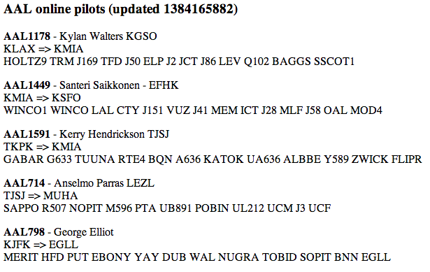

#Vatsimphp newbie tutorial

This tutorial will show you how to easily create an HTML page showing online pilots from the VATSIM network. The vatsimphp library has much more functionality than described in this tutorial. For full details consult our [documentation](https://github.com/skymeyer/Vatsimphp/blob/master/docs/index.md).

I tried to make this tutorial as easy as possible as not everybody is a hard core PHP coder and system administrator. The main target audience for this tutorial are novice users.

##Prerequisites

This tutorial assumes you have base knowledge of PHP and have a web server available with at least PHP 5.3 available. A database is optional. All examples are based on Linux, but can be easily interpretted for on a Windows environment too. This tutorial will not explain how to setup and manage a LAMP or WAMP stack. It speaks for itself that an Internet connection is also required.

> Make sure you have a PHP 5.3+ environment available on your local machine. I have not
> performed any tests yet on a Windows environment. If you find a problem, please use the [issues page](https://github.com/skymeyer/Vatsimphp/issues?state=open) to file a bug and
> we will address it as soon as possible.

The commands which are being executed in this tutorial are all prepended with a *$* (dollar) sign which represent the Linux shell prompt. Lines which do not start with *$* represent example output. Example running the "uptime" command and the example output:

```bash
$ uptime
 22:49pm  up 182 days  1:44,  1 user,  load average: 0.04, 0.04, 0.05
```

##Preparation

Let's start creating a fresh local directory where we will prepare our code. In case you have direct or SSH access to your web server, you can perform these steps directly from there too, as long as your are able to execute a few commands over there to setup the environment.

> I'm going to use the directory /home/batman/demo

```bash
$ cd /home/batman
$ mkdir demo
```

##Composer

The days are over to manually download libraries, unpack them and put them in the right place. For this we are going to use a package manager which will take care of a everything we need. Don't be scared if you have never done this before - it's super easy !

> If you already have composer installed on your system you can skip to the
> "Initialize vatsimphp" section below.

The package manager we are going to use is called *[composer](http://getcomposer.org/)*. For better exposure and dependency management, developers register their libraries and applications with a package manager. All packages directly available through *composer* are searchable at [packagist.org](https://packagist.org). The vatsimphp page can be found [here](https://packagist.org/packages/skymeyer/vatsimphp).

###Installing composer

The installation of *composer* is a one time thing to do. Note that *composer* is only needed on the host where you are preparing your code. It's not required to have  *composer* available on your web server. It only takes one command to install composer.

```bash
$ curl -sS https://getcomposer.org/installer | php -- --install-dir=/home/batman/bin
```

To install *composer* on Windows, you can use the [windows installer](https://getcomposer.org/Composer-Setup.exe) as described in the [composer installation guide](http://getcomposer.org/doc/00-intro.md#installation-windows).

> Composer is now installed as /home/batman/bin/composer.phar. To make things consistent
> between different install types, I'm going to rename this file to simply "composer".

```bash
$ cd /home/batman/bin
$ mv composer.phar composer
```

###Verify composer

Just to be sure before we continue, let's verify if *composer* is properly installed on your system by running the following command (works the same on Windows):

```bash
$ composer -V
Composer version a045ab345980bfe4a1daec1a34d345f13a2810dc 2013-11-06 22:13:14
```
On Windows you should be able to perform the same on the DOS prompt. Now that you have composer up and running on your local machine, you can leverage it for other projects too very easily, however this is out of scope of this tutorial.

##Initialize vatsimphp

We are not going into details on the different functionalities of *composer* and it's internal, but just show you how to get up and running to use vatsimphp. I promised that it is going to be very easy - so let's keep up with that promise: it only takes one single command :-)

```bash
$ cd /home/batman/demo
$ composer require skymeyer/vatsimphp 1.0.*
...
Writing lock file
Generating autoload files
```

You will see the following content in your working directory if the composer command terminated sucessfully:

```bash
$ ls -l
-rw-r--r-- 1 batman users   65 Nov 10 22:52 composer.json
-rw-r--r-- 1 batman users 5919 Nov 10 22:52 composer.lock
drwxr-xr-x 6 batman users 4096 Nov 10 22:52 vendor
```
Composer knows which dependencies are needed by vatsimphp and will automaticall install everything which is needed for you under the *vendor* directory. The two other files are automatically created for you and just describe your current configuration. Nothing to worry about.

##Our first script

Now that we have everything in place, let's create our first script using vatsimphp to pull data from the public VATSIM data servers.

###Create script

Use the editor of your choice to create the file *cron.php* inside our working directory containing the following code:

> My file will be /home/batman/demo/cron.php

```php
<?php
require_once 'vendor/autoload.php';
$vatsim = new \Vatsimphp\VatsimData();
$vatsim->loadData();
```

* The first line includes a file which has been autogenerated by *composer* and contains all the necessary logic for automatic class loading so we don't have to worry about which files to include - ever.
* The second line instantiates the main class from vatsimphp. This is the only class we actually need to interact with. All the other code from the vatsimphp library is nicely hidden for you.
* The third line will download the necessary data from the VATSIM network for us so we can interact with it later (see later).

###Test our script

Let's give our script a shot and verify that everything is properly working. Note that the execution will take some time (nothing will be printed on your screen) as we are going to perform a real download, so be patient until the script finishes.

Execute the following command from your demo directory:

```bash
$ php cron.php
```

Cool, but ... seriously what happened ? I will go into more details in the next sections, but let's verify that we have actually downloaded data from VATSIM. By default the downloaded files are stored under *vendor/skymeyer/vatsimphp/app/cache*. Let's check the content of this directory to verify:

```bash
$ cd vendor/skymeyer/vatsimphp/app/cache
$ ls -l
total 64
-rw-r--r-- 1 skymeyer users  1665 Nov 10 23:06 status.txt
-rw-r--r-- 1 skymeyer users 60700 Nov 10 23:06 vatsim-data.txt
```

You can open both files using a text editor and if everything went right you will find the current VATSIM data inside the *vatsim-data.txt* file.

##Vatsimphp background

Now that we have a working environment, let's take a closer look to what vatsimphp actually does for you and what the best way is to incorporate it into our small demo webpage we are going to build. VATSIM distributes every 2-5 minutes the current statistics  of all connected clients (pilots and controllers) to a couple of servers from which everybody can download this information.

###Bandwidth considerations

To safe bandwidth we have to avoid downloading over and over again this information from the same servers - hence the information is only updated every 2-5 minutes. There exists a  chance if you download too often that your IP will be blocked for a while making it impossible to update your local information.

Vatsimphp takes care of all this for you by implementing a local caching system. It will only try to download new information based on some built-in expire timers. It will also randomly pick one of the available data servers to avoid using the same data server.

> The timers can be changed at will, however it's not advised to change them without
> understanding the consequences. Vatsimphp ships out of the box with sensible preset
> timers for you. Changing the timers is out of scope for this tutorial.

###Response time

You already saw from your first test above that it takes some time to download/refresh the VATSIM data. Therefor it's not advised to actually run this logic inline when a user hits your web page. You want your website to be snappy and respond quickly.

We will use vatsimphp in two different modes:
* online mode: used by a scheduled tasks (cron) which keeps our information up-to-date
* cache mode: for our web page(s) we use the cached data for display purposes

> We have already created the first step in our *cron.php* file. We will use this script
> later on in this tutorial.

###Data validation

Vatsimphp will also validate the received data based on certain criteria. For example if one of the active data servers lags behind with updates (i.e. the data file has not been updated for 30 minutes), it will retry another server for valid data. A few other validation checks are in place, but nothing to worry about. Let vatsimphp do it's job for you without having to worry about the details.

##Test caching

Now that we know how vatsimphp caching works, let's test it out. As already explained above vatsimphp will take care of updating the cache files for you. You can check this by executing a couple of times the *cron.php* quickly after each other. The first time it may take some time to complete, however the subsequent runs will complete much faster as it doesn't really download anything. Don't be afraid to get locked out by one of the data servers, vatsimphp will prevent that for you.

> The default timers are as follows:
> * Master server refresh (status.txt) - 24 hours
> * Data refresh (vatsim-data.txt) - every 3 minutes
> * Local data cache expire timer - 1 hour
> * Metar refresh - every 10 minutes

## Logging

Vatsimphp has a built-in logging mechanism to troubleshoot what is actually going on behind the curtains. The log file is enabled by default and can be found at *vendor/skymeyer/vatsimphp/app/logs/vatsimphp.log*.

Execute the following command to display the log file:

```bash
$ tail -f vendor/skymeyer/vatsimphp/app/logs/vatsimphp.log
```

Now open a second shell and run our *cron.php* script againg:

```bash
$ php cron.php
```

When you look at the first terminal you will see something like this:

```
[2013-11-11 08:02:34] StatusSync.DEBUG: Registered url -> http://status.vatsim.net/status.txt []
[2013-11-11 08:02:34] StatusSync.DEBUG: Load from cache file /home/batman/demo/vendor/skymeyer/vatsimphp/src/Vatsimphp/../../app/cache/status.txt []
[2013-11-11 08:02:34] StatusParser.DEBUG: Data validated - dataUrls available []
[2013-11-11 08:02:34] DataSync.DEBUG: Registered urls {"18":"http://www.pcflyer.net/DataFeed/vatsim-data.txt","19":"http://fsproshop.com/servinfo/vatsim-data.txt","20":"http://info.vroute.net/vatsim-data.txt","21":"http://data.vattastic.com/vatsim-data.txt"}
[2013-11-11 08:02:34] DataSync.DEBUG: Load from cache file /home/batman/demo/vendor/skymeyer/vatsimphp/src/Vatsimphp/../../app/cache/vatsim-data.txt []
[2013-11-11 08:02:34] DataParser.DEBUG: Parsed section 'clients' []
[2013-11-11 08:02:34] DataParser.DEBUG: Parsed section 'prefile' []
[2013-11-11 08:02:34] DataParser.DEBUG: Parsed section 'servers' []
[2013-11-11 08:02:34] DataParser.DEBUG: Parsed section 'voice_servers' []
[2013-11-11 08:02:34] DataParser.DEBUG: General section: version -> 8 []
[2013-11-11 08:02:34] DataParser.DEBUG: General section: reload -> 2 []
[2013-11-11 08:02:34] DataParser.DEBUG: General section: update -> 20131111075901 []
[2013-11-11 08:02:34] DataParser.DEBUG: General section: atis_allow_min -> 5 []
[2013-11-11 08:02:34] DataParser.DEBUG: General section: connected_clients -> 192 []
[2013-11-11 08:02:34] DataParser.DEBUG: Valid data with timestamp 1384156741 []
```

You can see in the above example logging that both *status.txt* and *vatsim-datat.txt* have been loaded from our local cache files and are still valid. In case you need to debug your environment, this log file will be your friend and tell you exactly what's going on.

##Scheduled task
Time now to put our scheduled task in place so we are sure our local cache files will get updated automatically without having to worry about it. 

* On a linux system we can use *[cron](http://www.thegeekstuff.com/2009/06/15-practical-crontab-examples/)*
* Windows uses *[task scheduler](http://windows.microsoft.com/en-US/windows7/schedule-a-task)*

> When you are going to deploy your website on a shared hosting system, this functionality
> is mostly available through the control panel of you hoster. Please consult the support
> pages of your hoster if you are able to run cron jobs and under which conditions.

I'm going to schedule the execution of my *cron.php* file every minute as vatsimphp will take core of the actually download based on it's internal timers anyways. Using the following command my *crontab* file will be opened in my default editor (vim):

```bash
$ crontab -e
```

In my editor I add the following line to execute the *cron.php* file every minute:

```bash
* * * * * /usr/bin/php /home/batman/demo/cron.php
```

After saving and exiting from the editor the following will be shown before returning to the prompt:

```bash
crontab: installing new crontab
```

Now you can start monitoring the log file again and if everything went well you'll see new log message showing up every minute to inform you of it's activity.

```bash
$ tail -f vendor/skymeyer/vatsimphp/app/logs/vatsimphp.log
```

##Second script

Now that we have the data available from VATSIM, let's do something with it right ? I hope you are still with me to experience how easy the implementation works :-) Let's say we want to retrieve some information of all American Airlines (AAL) pilots on our website. 

> I'm picking "AAL" for this example as chances are very high such pilots are
> online. You can change "AAL" in this demo with something else in case no AAL pilots
> are online.

###Preparation
Create a file *pilots.php* in your working directory with the following content:

> I will be using the file */home/batman/demo/pilots.php*

```php
<?php
require_once 'vendor/autoload.php';

$logFile = __DIR__.'/vendor/skymeyer/vatsimphp/app/logs/pilots.log';
$callSign = 'AAL';

$vatsim = new \Vatsimphp\VatsimData();
$vatsim->setConfig('cacheOnly', true);
$vatsim->setConfig('logFile', $logFile);

if ($vatsim->loadData()) {
    $pilots = $vatsim->searchCallsign($callSign);
    foreach ($pilots as $pilot) {
        echo "{$pilot['callsign']} => {$pilot['realname']} \n";
    }
} else {
    echo "Data could not be loaded \n";
}
```

###Analysis

Let's analyze line by line the content of our code:
* As with our previous script we include the class autoloader logic
* We prepare two variables we will use later on: the $logFile name to use and the $callSign string we are going to search for
* Again we instantiate our VatsimData object we are going to work with
* A very important step here is to enable VatsimData in *cacheOnly* mode. We already have our cron job running in the background which is responsible to refresh our cached data.
* Secondly we are going to use a custom log file for our script to avoid cluttering the default log file which is already in use by our cron job. This is not required, but highly recommended for debug purposes if needed.

From here we are all set to load the data, perform our search and output the results:
* We have put the $vatsim->loadData() call inside an if-statement so we can take action if something went wrong loading the data. This can happen in case our cron job is no longer running and our data gets expired, or something is wrong with the VATSIM data servers, ... 
* If the data is loaded successfully we can finally make use of it. In this example code we are using *$vatsim->searchCallsign($callSign)* to search for all pilots (in this case with "AAL" in their callsign)
* Finally we iterate over the result and print some information on the screen (callsign and realname)

###Testing
Let's give it a shot if it works. Execute the *pilots.php* script:

```bash
$ php pilots.php
AAL1044 => Santeri Saikkonen - EFHK
AAL1178 => Kylan Walters KGSO
AAL1591 => Kerry Hendrickson TJSJ
AAL714 => Anselmo Parras LEZL
AAL798 => George Elliot
```

Obviously the output will be different for you depending on the currently online pilots :-)

> We will use this demo script later on to build our HTML demo page

##Easy API

To make life easy, we have provided what we call our *easy API* calls. These are straightforward to use methods which can be called on the VatsimData object to return VATSIM data. All *easy API* calls will return an *[iterator](http://www.sitepoint.com/php-simple-object-iterators/)* (with the exception of *getMetar* which just returns a string).

> List of *easy API* methods:
> * getGeneralInfo
> * getPilots
> * getControllers
> * getClients
> * getServers
> * getVoiceServers
> * getPrefile
> * searchCallsign
> * searchVatsimId
> * getMetar
>
>Please consult the following [examples](https://github.com/skymeyer/Vatsimphp/blob/master/examples/easy_api_examples.php) for the *easy API* calls. 

If you are not familiar with *iterators* you can always convert them into
normal array by call *toArray()* on them. However I do not see a real reason in doing
so, here is an example based on the $pilots variable above:

```php
$pilotsArray = $pilots->toArray();
```

You can play with the different *easy API* calls by putting them in the demo script above and using *var_dump* to see the contents. Here is an example:

```php
var_dump($vatsim->getGeneralInfo()->toArray());
```

##Advanced calls

There are more public methods available on the VatsimData object, but these are out of scope of this tutorial. Consult our [documentation page](https://github.com/skymeyer/Vatsimphp/blob/master/docs/index.md) for more information.

> List of other public API methods:
> * search
> * getObjectTypes
> * getArray
> * getIterator
> * getExceptionStack
> * setConfig
> * getConfig
> * loadData
> * loadMetar

##Demo webpage

Now that we have the data we are looking for, we can easily create some HTML around it. This is just a quick and dirty extended example based on our previous *pilots.php* file. There are better ways to do this using templating engines. Obviously this section is particularly for users who are new to building dynamic websites. Not really good practice to use below code in a production system, however that's out of scope of this tutorial.

```php
<?php
require_once 'vendor/autoload.php';

$logFile = __DIR__.'/vendor/skymeyer/vatsimphp/app/logs/pilots.log';
$callSign = 'AAL';

$vatsim = new \Vatsimphp\VatsimData();
$vatsim->setConfig('cacheOnly', true);
$vatsim->setConfig('logFile', $logFile);

if ($vatsim->loadData()) {
    $pilots = $vatsim->searchCallsign($callSign);
    $info = $vatsim->getGeneralInfo()->toArray();
}

?>
<html>
<head><title>demo AAL pilots</title></head>
<body>
<?php
if (empty($pilots)) {
    echo "<p>No AAL pilots online</p>";
} else {
    echo "<h3>AAL online pilots (updated {$info['update']})</h3>";
    foreach ($pilots as $p) {
        echo "<p><b>{$p['callsign']}</b> - {$p['realname']}<br />";
        echo "{$p['planned_depairport']} => {$p['planned_destairport']}<br />";
        echo "{$p['planned_route']}</p>";
    }
}
?>
</body>
</html>
```

When deployed on a web server, the output of the above code will look like this:



##Using a database

So far we have been using cache files to serve our data from. A more advanced approach can be to use vatsimphp to inject the VATSIM data into your database. This will be fairly easy to accomplish by extending the code in the *cron.php* file iterating over the received data and executing some SQL queries

Once your the VATSIM data is available in the database, you can use plain SQL code to retrieve data and display appropriately. This is however out of scope of this tutorial.

##Deploying on a web server

Once you have create your code it's time to upload everything to a web server. You can zip everything up from you working directory (in my case */home/batman/demo*) and upload it to it's final destination.

A few notes when doing this:
* Make sure your web server has PHP 5.3+ installed
* Make sure you zip *ALL* files, including the vendor directory (the composer.json and composer.lock file are not required)
* Enable the cron job properly
* Make sure your cache directory is writable (*vendor/skymeyer/vatsimphp/app/cache*)
* Make sure your log directory is writable (*vendor/skymeyer/vatsimphp/app/logs*)

##Getting in touch

Did you spot a bug ? Do you want a new feature to be added ? You can use our [issues page](https://github.com/skymeyer/Vatsimphp/issues?state=open) to report whatever you would like. This will be our primary channel of communication. 

There is also a [HipChat room](https://www.hipchat.com/gcbN8D1yF) where you can find us - however no warranties given on "online support" :-) Feel free to let us know if you are using vatsimphp or are interested to contribute to this project.

##Final words

Once you understand how to use the vatsimphp library it's fairly easy and a no-brainer to integrate it inside an already existing website or build a new application around it. If you haven't notice, the only PHP code we have written were just 2 single files:

*cron.php*
```php
<?php
require_once 'vendor/autoload.php';
$vatsim = new \Vatsimphp\VatsimData();
$vatsim->loadData();
```

*pilots.php*
```php
<?php
require_once 'vendor/autoload.php';

$logFile = __DIR__.'/vendor/skymeyer/vatsimphp/app/logs/pilots.log';
$callSign = 'AAL';

$vatsim = new \Vatsimphp\VatsimData();
$vatsim->setConfig('cacheOnly', true);
$vatsim->setConfig('logFile', $logFile);

if ($vatsim->loadData()) {
    $pilots = $vatsim->searchCallsign($callSign);
    foreach ($pilots as $pilot) {
        echo "{$pilot['callsign']} => {$pilot['realname']} \n";
    }
} else {
    echo "Data could not be loaded \n";
}
```

